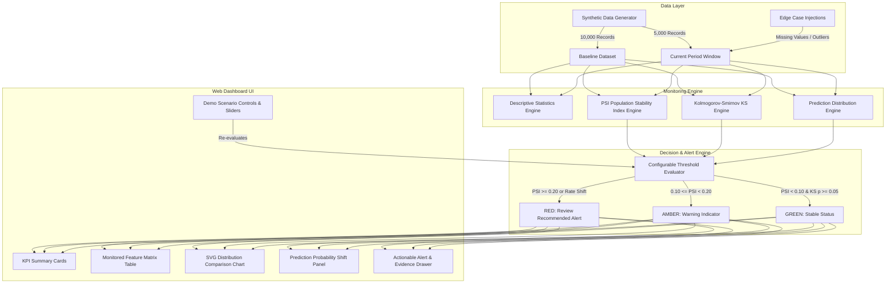

# ModelWatch — Enterprise ML Drift Monitoring System

> **Tagline:** *"Detect model behaviour changes before they become operational problems."*

ModelWatch is an enterprise-grade banking Machine Learning Drift & Performance Monitoring platform designed to detect statistical distribution shifts and prediction volume anomalies in deployed ML models (e.g., Fraud Detection and Service Prioritisation) before operational failures occur.

---

## 📌 Executive Summary & Key Capabilities

> [!IMPORTANT]
> **SYSTEM CAPABILITIES:**
> This repository implements a comprehensive banking ML monitoring platform.
> 
> **Key Capabilities & Features:**
> - Problem framing & executive dashboard architecture
> - Synthetic banking dataset generator (10,000 baseline observations, 5,000 current observations)
> - Baseline persistence & comparison engine
> - Real mathematical Population Stability Index (PSI) engine with 10 quantile bins
> - Kolmogorov-Smirnov (KS) statistic & asymptotic p-value engine
> - Feature-distribution drift detection across 9 core banking variables
> - Prediction-distribution & probability shift monitoring
> - Actionable alert generation ("REVIEW RECOMMENDED") with statistical evidence
> - Configurable statistical threshold controls (live recalculation sliders)
> - 4 Demo Scenarios (Scenario A Stable, Scenario B Drifted, Test Case 1 Missing Data, Test Case 2 Extreme Outliers)
> - Reproducible empirical experiment comparison matrix
> - Live diagnostic test suite with visible PASS/FAIL indicators
> - Stakeholder feedback form with pre-populated synthetic responses
> - Interactive 3-minute executive presentation guide & mathematical methodology guide

---

## 👥 Primary User Personas & Target Workflows

1. **ML / Data Science Team:** Monitors feature-level drift (PSI/KS), inspects distribution shift histograms, evaluates probability distribution changes, and determines whether model retraining is required.
2. **Risk / Fraud Operations Team:** Reviews high-level severity indicators (Green/Amber/Red), understands prediction rate anomalies, and follows clear operational review recommendations.
3. **Model Governance Manager:** Tracks monitoring history across persistent baselines, verifies threshold-based systematic review triggers, and ensures compliance auditing.

---

## 🏗 System Architecture



---

## 📐 Statistical Methodology

### 1. Population Stability Index (PSI)
$$PSI = \sum_{i=1}^{k} \left( E_i - A_i \right) \times \ln\left( \frac{E_i}{A_i} \right)$$
- $A_i$: Baseline population proportion in bin $i$
- $E_i$: Current monitoring population proportion in bin $i$
- **Threshold Interpretation:**
  - $PSI < 0.10$: **Stable** (No significant drift)
  - $0.10 \le PSI < 0.20$: **Warning** (Moderate distribution shift)
  - $PSI \ge 0.20$: **Critical** (Significant drift — Model Review Recommended)

### 2. Kolmogorov-Smirnov (KS) Test
$$D = \sup_x |F_{1,n_1}(x) - F_{2,n_2}(x)|$$
- Measures the maximum distance between baseline and current empirical cumulative distribution functions.
- If asymptotic $p$-value $< 0.05$, there is statistically significant evidence of distribution shift.

---

## 🚀 Running Locally

### Prerequisites
- Node.js version 18.0 or higher
- npm package manager

### Step-by-Step Commands

1. **Install dependencies:**
   ```bash
   npm install
   ```

2. **Start local development server:**
   ```bash
   npm run dev
   ```
   *The dashboard will automatically open at `http://localhost:3000`.*

3. **Run automated unit test suite:**
   ```bash
   npm test
   ```
   *Executes the mathematical assertion suite in Node.js.*

4. **Build production bundle:**
   ```bash
   npm run build
   ```

---

## 🧪 Automated Unit Test Suite

The repository includes an independent test suite in `src/tests/driftEngine.test.ts` covering:
- ✅ **PSI Calculation on Identical Arrays:** Asserts $PSI < 0.01$.
- ✅ **PSI Calculation on Shifted Arrays:** Asserts $PSI \ge 0.20$.
- ✅ **KS Test Statistic:** Asserts shift detection with $p < 0.05$.
- ✅ **Scenario A Classification:** Asserts stable dataset maps to GREEN status.
- ✅ **Scenario B Classification:** Asserts shifted dataset maps to RED alert.
- ✅ **Test Case 1 (Missing Data):** Asserts 18% missingness warning without engine crash.
- ✅ **Test Case 2 (Noisy Data):** Asserts outlier warning without engine crash.
- ✅ **Configurable Threshold Updates:** Asserts live status recalculation.

Tests can be executed via command line (`npm test`) or viewed live in the **Diagnostic Test Suite** tab inside the web UI.

---

## 🎬 3-Minute Presentation Demo Guide

1. **0:00–0:30:** Explain the core problem — banking models silently degrade when input customer distributions change post-deployment.
2. **0:30–1:00:** Show persistent 10,000 baseline dataset vs 5,000 current dataset across Fraud Detection and Service Prioritisation models.
3. **1:00–1:45:** Select **Scenario A: Stable Baseline** — highlight GREEN status (PSI < 0.10) with zero false alarms.
4. **1:45–2:30:** Select **Scenario B: Drifted Features** — show `transaction_amount` PSI reaching 0.27, triggering the **REVIEW RECOMMENDED** alert. Inspect the overlapping distribution SVG chart.
5. **2:30–3:00:** Show Test Case 1 (Missing Data), open the Diagnostic Test Suite tab (8/8 PASS), and point out Phase 2 roadmap tags.

---

## ⚠️ Security & Misuse Considerations for Prototype
- All data presented is 100% synthetically generated. No real customer or financial PII is used.
- Source code contains zero credentials or API keys.
- Input sliders constrain threshold values to positive valid numeric ranges (preventing negative/invalid mathematical inputs).
- Statistical warnings explicitly state that feature/prediction drift does *not* equal proven financial/fraud loss without ground-truth outcome verification.
